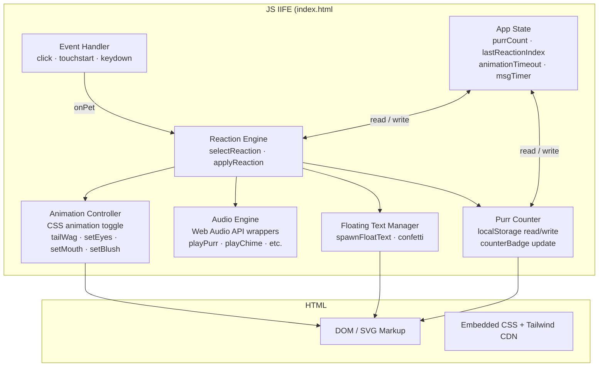

# Design Document — Pet the Cat

## Overview

Pet the Cat is a zero-dependency, single-page web application delivered as one `index.html` file. Users interact with a minimalist SVG cat illustration; each click, tap, or keyboard activation selects a random **Reaction** from a pool and plays it as a coordinated animation, optional sound, and floating text message.

There is no backend, no build step, and no network requests at runtime. All state is ephemeral within the page session, with a single integer (`purrCount`) persisted to `localStorage`. The app must function correctly across desktop and mobile browsers and must meet WCAG 2.1 AA keyboard and screen-reader requirements.

**Tech stack:**
- HTML5 (single file, no bundler)
- Tailwind CSS via CDN (utility styling, responsive layout)
- Vanilla JavaScript (ES2020 IIFE, no external libraries)

---

## Architecture

The entire application lives inside a single IIFE in `index.html`. There is no module system or build graph. Logical concerns are separated by function groups within that IIFE rather than by files.



### Key design decisions

| Decision | Rationale |
|---|---|
| Single HTML file | No build tooling required; deployable anywhere (GitHub Pages, local file open). |
| CSS keyframe animations instead of JS timers | Smooth 60 fps performance, GPU composited. JS only sets/clears `style.animation`. |
| Web Audio API synthesis instead of audio files | Zero external assets; works offline; no CORS issues. |
| IIFE with closure state | Avoids global namespace pollution without requiring ES modules or a bundler. |
| `touchstart` + `click` with dedup flag | Eliminates the 300 ms tap delay on mobile while preventing double-fire on devices that generate both events. |

---

## Components and Interfaces

### 1. Event Handler

Responsible for translating raw browser events into `onPet()` calls.

```
listeners:
  catWrap.addEventListener('click',      onPet)
  catWrap.addEventListener('touchstart', onPet, { passive: false })
  catWrap.addEventListener('keydown',    e => { if Enter|Space → onPet(e) })

dedup:
  lastEventType: '' | 'touch'
  touchstart sets lastEventType = 'touch'
  click handler returns early if lastEventType === 'touch', then resets it
```

### 2. Reaction Engine

Core selection and dispatch logic.

```
selectReaction(purrCount, lastReactionIndex, reactions, milestone) → Reaction
  if purrCount > 0 && purrCount % 10 === 0 → return milestone
  do
    idx = floor(random() * reactions.length)
    tries++
  while idx === lastReactionIndex && tries < 3
  return reactions[idx]

applyReaction(reaction) → void
  clears animationTimeout
  resets catSvg.style.animation (force reflow)
  sets catSvg.style.animation = reaction.animation + duration
  calls setEyes, setBlush, setMouth, setTailWag
  sets moodRing background color
  calls reaction.sound()
  schedules reset via animationTimeout
```

### 3. Animation Controller

Thin wrappers that mutate SVG element styles and attributes.

| Function | Effect |
|---|---|
| `setEyes(type)` | Replaces innerHTML of `#eye-left` and `#eye-right` SVG groups |
| `setBlush(on)` | Sets opacity of `#blush-left` / `#blush-right` |
| `setMouth(d)` | Sets `d` attribute of `#mouth-path` |
| `setTailWag(on)` | Starts/stops CSS `wiggle` animation on `#cat-tail` |

Animation names map to CSS `@keyframes` defined in `<style>`:
`bounce · wiggle · shake · spin · squish · nod · float · zoom · party`

A `prefers-reduced-motion` media query in CSS must override all `@keyframes` animations with `animation: none` or a static substitute.

### 4. Audio Engine

All sound is synthesised via the Web Audio API — no external audio files.

```
getAudioCtx() → AudioContext | null
  lazy-initialises a shared AudioContext
  returns null if Web Audio API is unavailable (catches constructor errors)

playTone({ type, freq, freq2, duration, gain, attack, decay })
  creates Oscillator → GainNode → destination
  applies linear frequency ramp and gain envelope
  safe-wraps in try/catch; silent failure if ctx is null

Sounds:
  playPurr()     → 3× sawtooth + square burst (cat purr texture)
  playChime()    → 4-note triangle arpeggio (heart/happy)
  playSurprised()→ sawtooth upward glide
  playGrumpy()   → square downward glide
  playSleepy()   → 2× descending sine
  playPlayful()  → 4-note triangle bounce
  playParty()    → 6-note ascending triangle
```

### 5. Floating Text Manager

```
spawnFloatText(text, x, y, color) → void
  creates <span class="float-text">
  positions via fixed left/top (px from getBoundingClientRect of catWrap)
  sets --dur CSS var to 850 + random()*300 ms  (range: [850, 1150] ⊂ [800,1200])
  appends to document.body
  listens for animationend → removes element

spawnConfetti(cx, cy, count) → void
  spawns <div class="confetti"> elements with random colours and positions
  each self-removes on animationend
```

Max 10 simultaneous floating text elements is enforced by the DOM naturally — each element is independent; cleanup is driven by its own `animationend` listener.

### 6. Purr Counter

```
init:
  raw = localStorage.getItem('purrCount')
  parsed = parseInt(raw, 10)
  purrCount = (isFinite(parsed) && parsed >= 0) ? parsed : 0
  counterBadge.textContent = purrCount

onPet:
  purrCount++
  localStorage.setItem('purrCount', purrCount)   // synchronous, before next interaction
  counterBadge.textContent = purrCount
  counterBadge triggers CSS counter-pop animation
```

### 7. Idle Behaviours

Two `setInterval` / recursive `setTimeout` loops run independently of pet interactions:

- **Tail sway** (`setInterval`, 2500 ms): applies a small random `rotate()` to `#cat-tail` if no reaction animation is active.
- **Idle blink** (recursive `setTimeout`, 2500–6500 ms): triggers `cat-eye-blink` CSS animation on both eyes if no reaction animation is active.

---

## Data Models

### Reaction

```js
{
  name:       string,          // unique identifier, e.g. 'happy'
  category:   string,          // 'happy' | 'surprised' | 'sleepy' | 'playful' | 'grumpy'
  messages:   string[],        // ≥ 3 distinct message strings
  animation:  string,          // CSS @keyframes name
  duration:   number,          // animation duration in ms
  moodColor:  string,          // CSS color for mood-ring glow
  blush:      boolean,         // show/hide blush cheeks
  mouth:      string,          // SVG path `d` attribute string
  eyes:       string,          // eye type: 'normal' | 'squint' | 'wide' | 'halfclosed' | 'narrow' | 'derp'
  tailWag:    boolean,         // start tail wag during reaction
  sound:      () => void,      // audio function; may be undefined
}
```

### MilestoneReaction

Identical schema to `Reaction`, with the addition of:

```js
{
  ...Reaction,
  confetti:   boolean,         // triggers spawnConfetti() when true
}
```

### AppState (closure variables)

```js
{
  purrCount:          number,   // non-negative integer; persisted to localStorage
  lastReactionIndex:  number,   // index into REACTIONS array; -1 = no previous
  animationTimeout:   number | null,  // setTimeout handle for animation reset
  msgTimer:           number | null,  // setTimeout handle for message strip fade
  audioCtx:           AudioContext | null,  // shared lazy AudioContext
  lastEventType:      '' | 'touch',   // touch/click dedup flag
}
```

### Reaction_Pool Configuration

```js
REACTIONS: Reaction[]   // exactly 10 at runtime; validated on init (length ≥ 8)

MILESTONE_REACTION: MilestoneReaction  // single celebratory reaction; not in REACTIONS array
```

---

## Correctness Properties

*A property is a characteristic or behavior that should hold true across all valid executions of a system — essentially, a formal statement about what the system should do. Properties serve as the bridge between human-readable specifications and machine-verifiable correctness guarantees.*

### Property 1: Reaction selection always returns a pool member

*For any* non-empty `Reaction_Pool` and any `purrCount` that is not a positive multiple of 10, calling `selectReaction()` always returns a `Reaction` whose reference exists in the `Reaction_Pool`.

**Validates: Requirements 2.1**

---

### Property 2: Floating text duration stays within required range

*For any* floating text element spawned by `spawnFloatText()`, its `--dur` CSS variable value (the animation duration) falls within the closed interval [800, 1200] ms.

**Validates: Requirements 2.3, 5.2**

---

### Property 3: Re-roll avoids immediate consecutive duplicate

*For any* `Reaction_Pool` with at least 2 distinct members and any valid `lastReactionIndex`, `selectReaction()` returns a reaction whose index differs from `lastReactionIndex`.

**Validates: Requirements 2.5**

---

### Property 4: Reaction pool meets minimum size and category coverage

*For any* valid app initialisation, the `REACTIONS` array has length ≥ 8, every reaction name is unique, and the union of reaction categories contains all five required values: `happy`, `surprised`, `sleepy`, `playful`, `grumpy`.

**Validates: Requirements 3.1, 3.2**

---

### Property 5: Milestone override fires on every multiple of 10

*For any* positive integer `purrCount` that is divisible by 10, `selectReaction(purrCount, ...)` returns `MILESTONE_REACTION` and not any member of `REACTIONS`.

**Validates: Requirements 3.3**

---

### Property 6: No reaction appears 3 or more consecutive times in normal play

*For any* sequence of pet events where `purrCount % 10 !== 0` throughout, the resulting sequence of selected reaction indices never contains the same index in 3 consecutive positions.

**Validates: Requirements 3.4**

---

### Property 7: Invalid pool blocks initialisation

*For any* `REACTIONS` array with fewer than 8 distinct reactions, the app initialisation function must not complete normally — it must surface an error state rather than allowing interaction.

**Validates: Requirements 3.5**

---

### Property 8: Purr counter increments by exactly 1 per pet

*For any* non-negative integer `purrCount` at the start of a pet event, the `purrCount` value after the event equals the prior value plus 1.

**Validates: Requirements 4.2**

---

### Property 9: Purr counter initialises from localStorage

*For any* non-negative integer `n` stored as a string under the key `'purrCount'` in `localStorage`, the app initialises `purrCount` to `n`. For any absent, non-numeric, or negative stored value, the app initialises `purrCount` to `0`.

**Validates: Requirements 4.3, 4.5**

---

### Property 10: Purr counter persists synchronously after each pet

*For any* pet event that sets `purrCount` to value `n`, immediately after the pet handler returns, `localStorage.getItem('purrCount')` equals the string `"n"`.

**Validates: Requirements 4.4**

---

### Property 11: Floating text DOM cleanup after animation

*For any* floating text element added to `document.body`, after its `animationend` event fires, the element is no longer present in `document.body.children`.

**Validates: Requirements 5.3**

---

### Property 12: Message selection always returns a pool member

*For any* `Reaction` in `REACTIONS` or `MILESTONE_REACTION`, each `Reaction.messages` array has length ≥ 3, and the message selected by the floating text spawn function is always a member of `reaction.messages`.

**Validates: Requirements 5.5**

---

### Property 13: Accessibility attributes are always present

*For any* rendered state of the app, the `#cat-wrap` element carries `aria-label="Pet the cat"`, `role="button"`, and `tabindex="0"` as attributes.

**Validates: Requirements 6.3**

---

## Error Handling

### localStorage unavailable or corrupt

- **Detection**: `parseInt(raw, 10)` returns `NaN` or a negative number; `localStorage` access throws (e.g., private browsing with storage blocked).
- **Handling**: `purrCount` defaults to `0`. No `localStorage.setItem` calls are made for the session. The app continues fully functional.
- **User impact**: Counter resets on every page load — no error is shown.

### Web Audio API unavailable

- **Detection**: `new AudioContext()` constructor throws, or `window.AudioContext` and `window.webkitAudioContext` are both `undefined`.
- **Handling**: `getAudioCtx()` returns `null`. All `playTone` / sound functions check for a null context and return early via `try/catch`.
- **User impact**: All reactions play silently — no UI error is shown (per Requirements 6.5).

### Invalid Reaction_Pool at runtime

- **Detection**: `REACTIONS.length < 8` at IIFE initialisation.
- **Handling**: The app must not enter the interactive state. Display an error message in the UI (e.g., replace the cat stage with an error banner).
- **User impact**: Visible error; no interaction is possible until the configuration is fixed.

### Animation interrupt / re-entry

- **Detection**: `animationTimeout` is non-null when `onPet()` is called.
- **Handling**: `clearTimeout(animationTimeout)` cancels the pending reset. `catSvg.style.animation = 'none'` + forced reflow resets the animation state before the new reaction starts.
- **User impact**: Seamless reaction restart with no visual glitch (per Requirements 2.6).

### Floating text overflow

- **Detection**: More than 10 simultaneous floating text elements.
- **Handling**: The current implementation spawns without a cap; if needed, a guard can check `document.querySelectorAll('.float-text').length` before spawning. Elements self-clean via `animationend`, so overflow is transient.
- **User impact**: Minimal — brief visual density during rapid tapping.

---

## Testing Strategy

Because the app is a single HTML file with no module system, tests must either:

1. **Extract pure logic** into testable functions (exported from a separate `logic.js` or inlined in a `<script type="module">` during test runs), or
2. **Use a headless browser** (Playwright / JSDOM) to test DOM-integrated behaviour.

The recommended approach is a hybrid: extract the pure functions (`selectReaction`, counter arithmetic, pool validation, floating text duration calculation) for property-based and unit testing, and use Playwright for DOM/accessibility integration tests.

### Property-Based Testing

**Library**: [fast-check](https://fast-check.dev/) (JavaScript PBT library, MIT licence).

**Configuration**: minimum 100 runs per property.

**Tag format**: `// Feature: pet-the-cat, Property N: <property_text>`

Each correctness property from the Correctness Properties section maps to exactly one property-based test:

| Property | Test description | Generators |
|---|---|---|
| P1 — Selection returns pool member | `fc.array(reactionArb, {minLength:1})` × `fc.integer` (non-milestone count) | arbitrary Reaction array, arbitrary purrCount |
| P2 — Float duration in range | `fc.double({min:0, max:1})` for random() stub | any random value → duration in [800,1200] |
| P3 — Re-roll avoids consecutive duplicate | `fc.array(reactionArb, {minLength:2})` × `fc.integer` (lastIdx) | pool ≥ 2, any lastIdx |
| P4 — Pool size and category coverage | Validate against `REACTIONS` constant | no generator needed (data invariant) |
| P5 — Milestone override | `fc.integer({min:1}).filter(n => n % 10 === 0)` | any positive multiple of 10 |
| P6 — No 3 consecutive repeats | `fc.integer({min:20})` for N events | simulate N pet events, check sequence |
| P7 — Invalid pool blocks init | `fc.array(reactionArb, {maxLength:7})` | any too-small pool |
| P8 — Counter increments by 1 | `fc.integer({min:0, max:1e9})` for initial count | any valid starting count |
| P9 — Counter init from storage | `fc.oneof(fc.integer({min:0}), fc.string())` | valid int or invalid string |
| P10 — Counter persists to storage | `fc.integer({min:0})` for initial count | any valid count |
| P11 — Float text DOM cleanup | JSDOM + `fc.string()` for message | any message string |
| P12 — Message selection from pool | `fc.array(fc.string(), {minLength:3})` for messages | any message array ≥ 3 |
| P13 — Aria attributes present | JSDOM static check | no generator needed |

### Unit Tests (example-based)

- Sound function invocation when reaction has a `sound` property (mock AudioContext).
- Sound functions do not throw when `AudioContext` is unavailable (null context).
- `onPet()` applies animation within the same call stack (synchronous style mutation).
- Animation interrupt: second `onPet()` clears the first timeout and resets animation.
- Keyboard handler triggers `onPet` for Enter and Space, does not trigger for other keys.
- Touch/click dedup: `touchstart` followed immediately by `click` fires `onPet` only once.
- CSS `@media (prefers-reduced-motion)` rule exists and targets cat animation properties.
- CSS `cursor: grab` is defined for `#cat-wrap`.
- Focus indicator CSS rule exists with sufficient contrast.

### Integration Tests (Playwright)

- Cat is visible and centered at viewport widths 320, 375, 768, 1440, 2560px.
- Cat bounding box is ≥ 200×200 at viewport > 375px and ≥ 150×150 at 375px.
- No horizontal scrollbar at any of the above viewports.
- `aria-label`, `role`, and `tabindex` attributes are present on the cat element.
- Pet event via keyboard Tab + Enter produces a visible reaction.
- Counter increments and is visible without scrolling after a pet.
- App loads and functions with no console errors in a stock browser environment.
